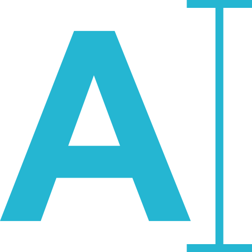

<a name="readme-top"></a>

[![Contributors][contributors-shield]][contributors-url]
[![Forks][forks-shield]][forks-url]
[![Stargazers][stars-shield]][stars-url]
[![Issues][issues-shield]][issues-url]
[![MIT License][license-shield]][license-url]
[![LinkedIn][linkedin-shield]][linkedin-url]

<br />
<div align="center">
  <a href="https://github.com/stanislavkhatko/blind-typing-tutor">
    
  </a>

<h3 align="center">Blind Typing Tutor</h3>

  <p align="center">
    A blind keyboard typing trainer app for English and Ukrainian languages
    <br />
    <br />
    <br />
    <a href="https://typot.netlify.app/en.html">View Demo</a>
    ·
    <a href="https://github.com/stanislavkhatko/blind-typing-tutor/issues">Report Bug</a>
    ·
    <a href="https://github.com/stanislavkhatko/blind-typing-tutor/issues">Request Feature</a>
  </p>
</div>


## About The Project

[![Product Name Screen Shot][product-screenshot]](https://example.com)

There are quite a lot of blind typing tutors out there, but once searching I didn't find Ukrainian language so I made own solution.


### Built With
![JavaScript][JavaScript]


## Getting Started
To run project locally perform next steps

### Installation

1. Clone the repo
   ```sh
   git clone https://github.com/stanislavkhatko/blind-typing-tutor.git
   ```
2. Install NPM packages
   ```sh
   npm install
   ```
3. Build assets and files by running at terminal
   ```sh
   npm run build
   ```
4. Open file in browser
   ```
   public/index.html or public/en.html
   ```


## Roadmap

- [ ] More languages
- [ ] Vocabulary choice

See the [open issues](https://github.com/stanislavkhatko/blind-typing-tutor/issues) for a full list of proposed features (and known issues).


[contributors-shield]: https://img.shields.io/github/contributors/stanislavkhatko/blind-typing-tutor.svg?style=for-the-badge
[contributors-url]: https://github.com/stanislavkhatko/blind-typing-tutor/graphs/contributors
[forks-shield]: https://img.shields.io/github/forks/stanislavkhatko/blind-typing-tutor.svg?style=for-the-badge
[forks-url]: https://github.com/stanislavkhatko/blind-typing-tutor/network/members
[stars-shield]: https://img.shields.io/github/stars/stanislavkhatko/blind-typing-tutor.svg?style=for-the-badge
[stars-url]: https://github.com/stanislavkhatko/blind-typing-tutor/stargazers
[issues-shield]: https://img.shields.io/github/issues/stanislavkhatko/blind-typing-tutor.svg?style=for-the-badge
[issues-url]: https://github.com/stanislavkhatko/blind-typing-tutor/issues
[license-shield]: https://img.shields.io/github/license/stanislavkhatko/blind-typing-tutor.svg?style=for-the-badge
[license-url]: https://github.com/stanislavkhatko/blind-typing-tutor/blob/master/LICENSE.txt
[linkedin-shield]: https://img.shields.io/badge/-LinkedIn-black.svg?style=for-the-badge&logo=linkedin&colorB=555
[linkedin-url]: https://linkedin.com/in/stanislavkhatko
[product-screenshot]: screenshot.png
[JavaScript]: https://img.shields.io/badge/logo-javascript-blue?logo=javascript
